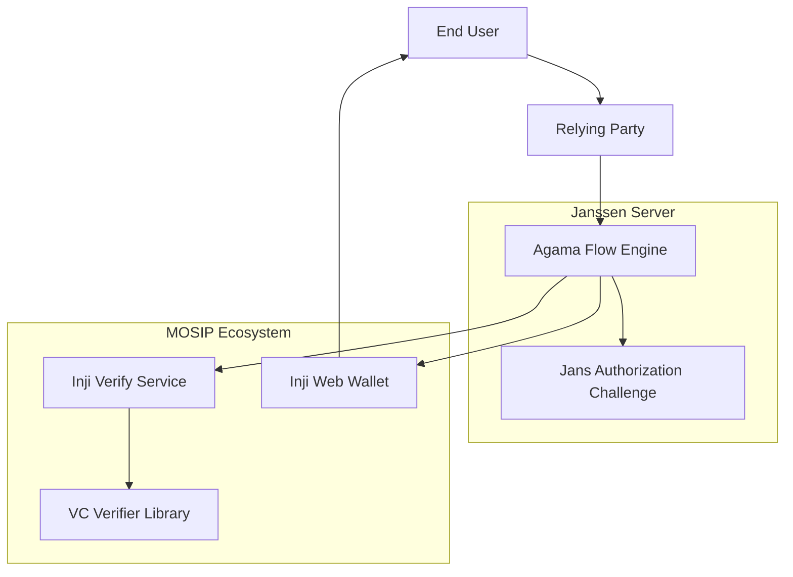
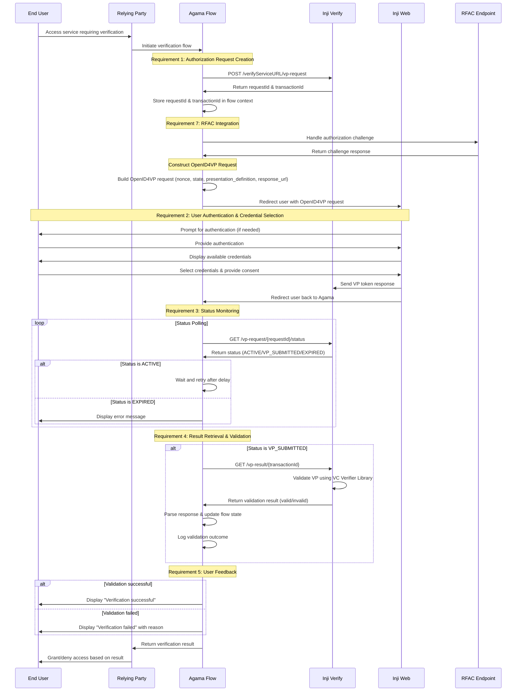

# Design Document

## Overview

The Agama-Inji-Wallet integration implements a comprehensive OpenID for Verifiable Presentations (OpenID4VP) workflow that enables secure credential verification through the MOSIP ecosystem. The system leverages Janssen's Agama DSL framework to orchestrate interactions between users, the Inji Web wallet, and the Inji Verify service.

This design enables users to present verifiable credentials stored in their Inji wallet to relying parties through a standardized, secure, and user-friendly verification process. The Agama flow serves as the central orchestrator, written in Agama DSL, managing the complex interactions between components while providing robust error handling, logging, and security features according to Agama execution rules.

## Architecture

### High-Level Architecture

The system follows a distributed architecture pattern with clear separation of concerns:



### Component Responsibilities

- **Agama Flow Engine**: Central orchestrator managing the entire verification workflow
- **Inji Verify Service**: Credential verification service with REST API endpoints
- **Inji Web Wallet**: User-facing wallet application for credential management and presentation
- **VC Verifier Library**: Core cryptographic verification component
- **RFAC (Jans Authorization Challenge)**: Security component for authorization challenges

### Sequence Diagram



## Components and Interfaces

### Agama Flow Implementation

**Purpose**: Central orchestration component implemented as an Agama DSL flow managing the entire verification workflow.

**Flow Structure**:
```agama
Flow com.gluu.agama.inji.VerifyCredential
    Basepath "inji-verify"
    Timeout 300 seconds
    Configs configs
    Inputs credentialType presentationDefinition

// Flow implementation follows Agama DSL patterns
```

**Key Components**:
- **Java Helper Classes**: Foreign routines for complex operations via `Call` directive
- **Web Templates**: UI pages for user interaction via `RRF` directive  
- **RFAC Integration**: Browser redirects via `RFAC` directive
- **Flow State**: Agama variables for session management

**Java Helper Classes** (accessed via `Call`):
```java
// Authorization request creation (Requirement 1)
Call com.gluu.agama.inji.InjiVerifyClient#createAuthorizationRequest verifyServiceURL
Call com.gluu.agama.inji.OpenID4VPBuilder#constructRequest nonce state presentationDefinition responseUrl

// Status monitoring (Requirement 3)  
Call com.gluu.agama.inji.InjiVerifyClient#pollVerificationStatus requestId maxRetries retryDelay
Call com.gluu.agama.inji.StatusHandler#handleResponse status

// Result processing (Requirement 4)
Call com.gluu.agama.inji.InjiVerifyClient#fetchVerificationResult transactionId
Call com.gluu.agama.inji.ResultParser#parseValidationResponse response

// Error handling (Requirement 6)
Call com.gluu.agama.inji.ErrorHandler#logAPIFailure endpoint error timestamp
Call com.gluu.agama.inji.RetryHandler#implementRetryMechanism operation maxRetries

// RFAC integration (Requirement 7)
Call com.gluu.agama.inji.RFACHandler#handleChallenge challengeData
```

### Inji Verify Service Interface

**Purpose**: External service providing credential verification capabilities, accessed through Java helper classes.

**API Endpoints** (wrapped in Java classes):
- `POST /verifyServiceURL/vp-request`: Create verification request
- `GET /vp-request/{requestId}/status`: Check verification status  
- `GET /vp-result/{transactionId}`: Retrieve verification result

**Java Client Implementation**:
```java
public class InjiVerifyClient {
    public Map<String, Object> createAuthorizationRequest(String verifyServiceURL, Map<String, Object> requestData);
    public Map<String, Object> pollVerificationStatus(String requestId, int maxRetries, int retryDelay);
    public Map<String, Object> fetchVerificationResult(String transactionId);
}
```

**Request/Response Models** (handled in Java, exposed to Agama as Maps):
```json
// Authorization Request
{
  "presentationDefinition": {...},
  "clientId": "string", 
  "responseUri": "string",
  "nonce": "string"
}

// Authorization Response
{
  "requestId": "string",
  "transactionId": "string", 
  "authorizationUrl": "string"
}

// Status Response
{
  "status": "ACTIVE|VP_SUBMITTED|EXPIRED",
  "timestamp": "ISO8601"
}

// Verification Result
{
  "result": "valid|invalid",
  "reason": "string",
  "verificationDetails": {...}
}
```

### OpenID4VP Request Builder (Java Helper)

**Purpose**: Constructs standards-compliant OpenID4VP requests, implemented as Java class.

```java
public class OpenID4VPBuilder {
    public Map<String, Object> constructRequest(String nonce, String state, 
                                               Map<String, Object> presentationDefinition, 
                                               String responseUrl);
    public String generateNonce();
    public String generateState();
    public String buildRedirectURL(Map<String, Object> request);
}
```

### Flow State Management (Agama Variables)

**Purpose**: Manages session state using Agama's built-in variable system.

**Agama State Variables**:
```agama
// Session tracking variables
sessionId = null
requestId = null
transactionId = null
nonce = null
state = null

// Status tracking
verificationStatus = "INITIATED"
verificationResult = null
errorDetails = null

// Configuration from flow configs
verifyServiceURL = configs.inji.verifyServiceURL
maxRetries = configs.polling.maxRetries
retryDelay = configs.polling.retryDelay
```

## Data Models

### Agama Flow Data Structures

**Verification Session** (Agama Map):
```agama
session = {
  sessionId: "generated-uuid",
  requestId: null,
  transactionId: null, 
  nonce: null,
  state: null,
  status: "INITIATED",
  createdAt: null,
  verificationResult: null,
  errorDetails: null
}
```

**OpenID4VP Request** (Agama Map):
```agama
openid4vpRequest = {
  responseType: "vp_token",
  clientId: configs.client.clientId,
  redirectUri: configs.client.redirectUri,
  scope: "openid",
  nonce: null,
  state: null,
  presentationDefinition: null,
  responseMode: "form_post"
}
```

**Verification Result** (Agama Map):
```agama
verificationResult = {
  isValid: false,
  reason: null,
  verificationDetails: {
    credentialType: null,
    issuer: null,
    validationTimestamp: null,
    verifierLibraryVersion: null
  }
}
```

### Java Data Transfer Objects

**For complex operations handled in Java helpers**:
```java
public class VerificationSession {
    private String sessionId;
    private String requestId;
    private String transactionId;
    private String nonce;
    private String state;
    private String status;
    private Date createdAt;
    private Map<String, Object> verificationResult;
    private Map<String, Object> errorDetails;
}
```

## Error Handling

### Error Categories

1. **Network Errors**: Timeouts, connection failures, DNS resolution issues
2. **API Errors**: 4xx/5xx HTTP responses from Inji Verify
3. **Validation Errors**: Invalid VP tokens, expired credentials
4. **Flow Errors**: Invalid state transitions, missing context data
5. **Security Errors**: RFAC failures, nonce mismatches

### Error Handling Strategy

**Agama Error Handling Patterns**:
```agama
// Try-catch pattern using pipe operator
result | error = Call com.gluu.agama.inji.InjiVerifyClient#createAuthorizationRequest verifyServiceURL

When error is not null
    Log "@error API call failed:" error.message
    errorDetails = { type: "API_FAILURE", message: error.message, timestamp: error.timestamp }
    RRF "error.htm" errorDetails
    Finish false

// Retry logic with Repeat construct
Repeat configs.maxRetries times max
    result | error = Call com.gluu.agama.inji.InjiVerifyClient#pollVerificationStatus requestId
    Quit When error is null
    Log "@warn Retrying API call, attempt:" idx[0]
    Call com.gluu.agama.inji.Utils#sleep configs.retryDelay
```

**Error Logging** (Java Helper):
```java
public class ErrorHandler {
    public void logAPIFailure(String endpoint, Exception error, Map<String, Object> context) {
        Map<String, Object> logEntry = new HashMap<>();
        logEntry.put("timestamp", Instant.now().toString());
        logEntry.put("level", "ERROR");
        logEntry.put("category", "API_FAILURE");
        logEntry.put("endpoint", endpoint);
        logEntry.put("error", error.getMessage());
        logEntry.put("context", context);
        // Write to audit log
    }
}
```

**User-Friendly Error Messages**:
- Agama `RRF` templates with localized error messages
- Generic messages for security-sensitive errors  
- Clear next steps and recovery options via UI templates

## Testing Strategy

### Unit Testing
- **Agama Flow Components**: Mock external dependencies (Inji Verify, RFAC)
- **OpenID4VP Request Builder**: Validate request structure and compliance
- **Error Handling**: Test all error scenarios and recovery paths
- **State Management**: Verify state transitions and data persistence

### Integration Testing
- **Inji Verify API**: Test against actual service endpoints
- **RFAC Integration**: Validate authorization challenge flows
- **End-to-End Flows**: Complete verification workflows
- **Error Scenarios**: Network failures, service unavailability

### Security Testing
- **Nonce Validation**: Prevent replay attacks
- **State Parameter Security**: CSRF protection
- **RFAC Challenge Validation**: Authorization security
- **Credential Validation**: VP token integrity

### Performance Testing
- **Status Polling**: Optimize polling intervals and retry logic
- **Concurrent Sessions**: Multiple simultaneous verification flows
- **Load Testing**: High-volume verification scenarios

## Security Considerations

### Authentication & Authorization
- **RFAC Integration**: Secure authorization challenges per Jans Server specification
- **Session Management**: Secure session tokens and state management
- **Credential Validation**: Cryptographic verification of VP tokens

### Data Protection
- **Sensitive Data Handling**: Secure storage and transmission of credentials
- **Audit Logging**: Comprehensive logging without exposing sensitive data
- **Error Information**: Sanitized error messages to prevent information leakage

### Communication Security
- **TLS/HTTPS**: All communications encrypted in transit
- **API Security**: Proper authentication for Inji Verify API calls
- **Redirect Security**: Validate redirect URLs and prevent open redirects

## Configuration Management

### Agama Flow Configuration

**Flow Header Configuration**:
```agama
Flow com.gluu.agama.inji.VerifyCredential
    Basepath "inji-verify"
    Timeout 300 seconds
    Configs configs
    Inputs credentialType presentationDefinition
```

**Configuration Properties** (accessed via `configs` variable):
```json
{
  "inji": {
    "verify": {
      "baseUrl": "https://dev-verify.inji.io",
      "timeout": 30000,
      "retryAttempts": 3
    },
    "web": {
      "baseUrl": "https://dev-wallet.inji.io"
    }
  },
  "polling": {
    "maxRetries": 30,
    "retryDelay": 2000
  },
  "client": {
    "clientId": "agama-inji-client",
    "redirectUri": "https://jans.example.com/callback"
  },
  "rfac": {
    "timeout": 10000
  },
  "logging": {
    "level": "DEBUG",
    "auditEnabled": true
  }
}
```

**Configuration Access in Flow**:
```agama
// Access configuration values
verifyServiceURL = configs.inji.verify.baseUrl
maxRetries = configs.polling.maxRetries
clientId = configs.client.clientId

// Use in Java calls
result = Call com.gluu.agama.inji.InjiVerifyClient#createAuthorizationRequest verifyServiceURL
```

### Runtime Configuration
- **Agama Engine Configuration**: Managed through Janssen Server admin interface
- **Flow Properties**: Updated without flow redeployment
- **Environment-Specific**: Different configs per deployment environment

## Monitoring and Observability

### Metrics Collection
- **Verification Success Rate**: Percentage of successful verifications
- **Response Times**: API call latencies and flow completion times
- **Error Rates**: Categorized error frequencies
- **User Experience**: Time-to-completion metrics

### Logging Strategy
- **Structured Logging**: JSON-formatted logs with consistent schema
- **Correlation IDs**: Track requests across service boundaries
- **Audit Trail**: Complete verification workflow history
- **Security Events**: Authentication failures, suspicious activities

### Health Checks
- **Service Dependencies**: Monitor Inji Verify and RFAC availability
- **Flow State**: Detect stuck or orphaned verification sessions
- **Resource Utilization**: Memory, CPU, and connection pool metrics

## Agama Flow Implementation Example

### Main Verification Flow

```agama
Flow com.gluu.agama.inji.VerifyCredential
    Basepath "inji-verify"
    Timeout 300 seconds
    Configs configs
    Inputs credentialType presentationDefinition

// Initialize session
sessionId = Call com.gluu.agama.inji.Utils#generateUUID
Log "@info Starting Inji verification flow, session:" sessionId

// Requirement 1: Create authorization request to Inji Verify
Log "@info Creating authorization request to Inji Verify"
authRequest = {
    presentationDefinition: presentationDefinition,
    clientId: configs.client.clientId,
    responseUri: configs.client.redirectUri,
    nonce: Call com.gluu.agama.inji.Utils#generateNonce
}

authResponse | error = Call com.gluu.agama.inji.InjiVerifyClient#createAuthorizationRequest configs.inji.verify.baseUrl authRequest

When error is not null
    Log "@error Failed to create authorization request:" error.message
    errorData = { message: "Failed to initiate verification", details: error.message }
    RRF "error.htm" errorData
    Finish false

// Store flow context
requestId = authResponse.requestId
transactionId = authResponse.transactionId
state = authResponse.state

Log "@info Authorization request created, requestId:" requestId "transactionId:" transactionId

// Requirement 7: RFAC Integration for secure authorization
Log "@info Handling RFAC challenge"
rfacData | rfacError = Call com.gluu.agama.inji.RFACHandler#handleChallenge requestId transactionId

When rfacError is not null
    Log "@error RFAC challenge failed:" rfacError.message
    Finish false

// Construct OpenID4VP request and redirect to Inji Web
Log "@info Constructing OpenID4VP request"
openid4vpRequest = Call com.gluu.agama.inji.OpenID4VPBuilder#constructRequest authResponse.nonce state presentationDefinition configs.client.redirectUri

// Requirement 2: Redirect user to Inji Web for authentication and credential selection
Log "@info Redirecting user to Inji Web wallet"
walletUrl = Call com.gluu.agama.inji.OpenID4VPBuilder#buildRedirectURL configs.inji.web.baseUrl openid4vpRequest

// Use RFAC to redirect to Inji Web and wait for callback
callbackData = RFAC walletUrl

Log "@info User returned from Inji Web wallet"

// Requirement 3: Monitor verification status
Log "@info Starting status polling for requestId:" requestId
verificationStatus = "ACTIVE"

Repeat configs.polling.maxRetries times max
    statusResponse | statusError = Call com.gluu.agama.inji.InjiVerifyClient#pollVerificationStatus requestId
    
    When statusError is not null
        Log "@warn Status polling failed, retrying:" statusError.message
        Call com.gluu.agama.inji.Utils#sleep configs.polling.retryDelay
        // Continue to next iteration
    Otherwise
        verificationStatus = statusResponse.status
        Log "@info Current verification status:" verificationStatus
        
        Match verificationStatus to
            "VP_SUBMITTED"
                Log "@info VP submitted, proceeding to fetch result"
                Quit
            "EXPIRED"
                Log "@error Verification request expired"
                errorData = { message: "Verification request has expired", details: "Please try again" }
                RRF "error.htm" errorData
                Finish false
            "ACTIVE"
                Log "@info Status still active, continuing to poll"
                Call com.gluu.agama.inji.Utils#sleep configs.polling.retryDelay

// Check if we exited due to max retries
When verificationStatus is not "VP_SUBMITTED"
    Log "@error Max polling attempts reached without VP submission"
    errorData = { message: "Verification timeout", details: "The verification process took too long" }
    RRF "error.htm" errorData
    Finish false

// Requirement 4: Retrieve and validate verification result
Log "@info Fetching verification result for transactionId:" transactionId
verificationResult | resultError = Call com.gluu.agama.inji.InjiVerifyClient#fetchVerificationResult transactionId

When resultError is not null
    Log "@error Failed to fetch verification result:" resultError.message
    errorData = { message: "Failed to retrieve verification result", details: resultError.message }
    RRF "error.htm" errorData
    Finish false

// Parse and validate the result
Log "@info Parsing verification result"
parsedResult | parseError = Call com.gluu.agama.inji.ResultParser#parseValidationResponse verificationResult

When parseError is not null
    Log "@error Failed to parse verification result:" parseError.message
    Finish false

// Log validation outcome for audit
auditData = {
    sessionId: sessionId,
    requestId: requestId,
    transactionId: transactionId,
    result: parsedResult.result,
    timestamp: Call com.gluu.agama.inji.Utils#getCurrentTimestamp
}
Call com.gluu.agama.inji.AuditLogger#logVerificationOutcome auditData

// Requirement 5: Display result to user
When parsedResult.isValid is true
    Log "@info Verification successful for session:" sessionId
    successData = {
        message: "Verification successful",
        credentialType: credentialType,
        verificationDetails: parsedResult.verificationDetails
    }
    RRF "success.htm" successData
    Finish { success: true, data: parsedResult }
Otherwise
    Log "@warn Verification failed for session:" sessionId "reason:" parsedResult.reason
    failureData = {
        message: "Verification failed",
        reason: parsedResult.reason,
        credentialType: credentialType
    }
    RRF "failure.htm" failureData
    Finish { success: false, error: parsedResult.reason }
```

### Supporting Templates

**Error Template** (`web/inji-verify/error.htm`):
```html
<!DOCTYPE html>
<html>
<head>
    <title>Verification Error</title>
    <link rel="stylesheet" href="styles/error.css">
</head>
<body>
    <div class="error-container">
        <h1>Verification Error</h1>
        <p class="error-message">${message}</p>
        <p class="error-details">${details}</p>
        <button onclick="window.history.back()">Try Again</button>
    </div>
</body>
</html>
```

**Success Template** (`web/inji-verify/success.htm`):
```html
<!DOCTYPE html>
<html>
<head>
    <title>Verification Successful</title>
    <link rel="stylesheet" href="styles/success.css">
</head>
<body>
    <div class="success-container">
        <h1>✓ Verification Successful</h1>
        <p>Your ${credentialType} credential has been successfully verified.</p>
        <div class="verification-details">
            <h3>Verification Details:</h3>
            <p>Issuer: ${verificationDetails.issuer}</p>
            <p>Verified at: ${verificationDetails.validationTimestamp}</p>
        </div>
        <button onclick="window.close()">Continue</button>
    </div>
</body>
</html>
```

## Deployment Considerations

### Agama Project Structure
```
agama-inji-wallet.gama
├── code/
│   └── com.gluu.agama.inji.VerifyCredential.flow
├── lib/
│   └── com/gluu/agama/inji/
│       ├── InjiVerifyClient.java
│       ├── OpenID4VPBuilder.java
│       ├── RFACHandler.java
│       ├── ResultParser.java
│       ├── ErrorHandler.java
│       ├── AuditLogger.java
│       └── Utils.java
├── web/
│   └── inji-verify/
│       ├── error.htm
│       ├── success.htm
│       ├── failure.htm
│       └── styles/
│           ├── error.css
│           ├── success.css
│           └── common.css
└── project.json
```

### Scalability
- **Agama Flow Statelessness**: Flows are stateless by design, enabling horizontal scaling
- **Session Management**: Leverages Janssen Server's built-in session management
- **Connection Pooling**: Java helper classes manage HTTP connections efficiently

### High Availability
- **Flow Timeout**: Configurable timeout prevents hung sessions
- **Retry Logic**: Built-in retry mechanisms for transient failures
- **Error Recovery**: Graceful error handling with user-friendly messages

### Security Hardening
- **RFAC Security**: Leverages Janssen's secure callback mechanism
- **Configuration Security**: Sensitive data in flow configs, not in code
- **Audit Logging**: Comprehensive logging for security monitoring